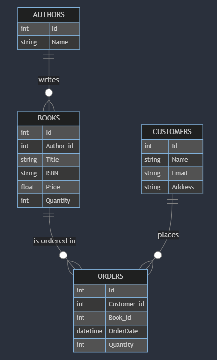

# Design Document for Online Bookstore Database
## Scope

The database for the Online Bookstore includes all essential entities necessary to facilitate the process of managing books, authors, customers, and orders. As such, included in the database's scope is:

* Authors, including basic identifying information
* Books, including details such as title, ISBN, price, and quantity in stock
* Customers, including basic identifying information
* Orders, including information about which customer ordered which book(s) and when

Out of scope are elements like book reviews, shipping details, and other non-core attributes. While these features could enhance the user experience, they are not essential for the basic functioning of an online bookstore and can be considered for future iterations of the database design.

## Functional Requirements

This database will support:

* CRUD operations for authors, books, customers, and orders
* Tracking book inventory
* Managing customer orders
* Associating books with their authors
* Retrieving order history for customers
* Generating reports on book sales and inventory levels
* Searching for books by title, author, or ISBN
* Updating book quantities when orders are placed

The database is designed to be the backbone of an online bookstore system, providing the necessary data storage and retrieval capabilities to support a web application frontend. It should be able to handle concurrent operations and maintain data integrity even under high load conditions.

## Representation

Entities are captured in SQLite tables with the following schema. SQLite was chosen for its simplicity, portability, and suitability for smaller to medium-sized applications. For larger scale deployments, migration to a more robust database system like PostgreSQL might be considered in the future.

### Entities

The database includes the following entities:

#### Authors

The `Authors` table includes:

* `Id`, which specifies the unique ID for the author as an `INTEGER`. This column has the `PRIMARY KEY` constraint applied.
* `Name`, which specifies the author's full name as `TEXT`.

The `Authors` table is designed to be simple yet effective. It stores only the essential information about authors. In future iterations, additional fields such as biography, date of birth, or nationality could be added to provide more comprehensive author information.

#### Books

The `Books` table includes:

* `Id`, which specifies the unique ID for the book as an `INTEGER`. This column has the `PRIMARY KEY` constraint applied.
* `Author_id`, which is the ID of the author who wrote the book as an `INTEGER`. This column has the `FOREIGN KEY` constraint applied, referencing the `Id` column in the `Authors` table.
* `Title`, which specifies the book's title as `TEXT`.
* `ISBN`, which specifies the book's ISBN as `TEXT`. This column has a `UNIQUE` constraint.
* `Price`, which specifies the book's price as `NUMERIC`.
* `Quantity`, which specifies the number of copies in stock as an `INTEGER`.

The `Books` table is the central entity in our database. It connects to authors and is referenced by orders. The `UNIQUE` constraint on ISBN ensures that no duplicate books are entered into the system. The `Quantity` field allows for real-time inventory tracking.

#### Customers

The `Customers` table includes:

* `Id`, which specifies the unique ID for the customer as an `INTEGER`. This column has the `PRIMARY KEY` constraint applied.
* `Name`, which specifies the customer's full name as `TEXT`.
* `Email`, which specifies the customer's email address as `TEXT`. This column has a `UNIQUE` constraint.
* `Address`, which specifies the customer's address as `TEXT`.

The `Customers` table stores essential information about the bookstore's clients. The `UNIQUE` constraint on the `Email` field ensures that each customer account is associated with a unique email address, which can be used for login purposes in the future.

#### Orders

The `Orders` table includes:

* `Id`, which specifies the unique ID for the order as an `INTEGER`. This column has the `PRIMARY KEY` constraint applied.
* `Customer_id`, which is the ID of the customer who placed the order as an `INTEGER`. This column has the `FOREIGN KEY` constraint applied, referencing the `Id` column in the `Customers` table.
* `Book_id`, which is the ID of the book that was ordered as an `INTEGER`. This column has the `FOREIGN KEY` constraint applied, referencing the `Id` column in the `Books` table.
* `OrderDate`, which is the timestamp at which the order was placed. This column uses the `DATETIME` type with a `DEFAULT` value of `CURRENT_TIMESTAMP`.
* `Quantity`, which specifies the number of books ordered as an `INTEGER`.

The `Orders` table serves as a transaction log, recording each purchase made by customers. The `FOREIGN KEY` constraints ensure data integrity by linking orders to valid customers and books.

### Relationships

The below entity relationship diagram describes the relationships among the entities in the database.



* One author can write many books, but each book is written by one author (one-to-many).
* A customer can place many orders, and each order is associated with one customer (one-to-many).
* A book can be in many orders, and each order is for one type of book (one-to-many).

These relationships reflect the real-world connections between authors, books, customers, and orders. The one-to-many relationship between books and orders simplifies the order process but limits each order to a single book type. This design choice balances simplicity with functionality for this version of the database.

## Optimizations

To optimize common queries, the following indexes are created:

* `author_name_search` on `Authors(Name)`
* `book_title_search` on `Books(Title)`
* `book_quantity_search` on `Books(Quantity)`
* `book_isbn_search` on `Books(ISBN)`
* `book_price_search` on `Books(Price)`
* `customer_search` on `Customers(Name, Email)`
* `order_customer_search` on `Orders(Customer_id)`
* `order_book_search` on `Orders(Book_id)`

These indexes speed up searches for authors by name, books by title, ISBN, or price, customers by name or email, and orders by customer or book. The choice of indexes reflects the anticipated common query patterns for an online bookstore.

### View Creation

A view called `OrderDetails` is created to simplify order-related queries:

```sql
CREATE VIEW OrderDetails AS
SELECT
    Customers.Name AS CustomerName,
    Customers.Email AS CustomerEmail,
    Books.Title AS BookTitle,
    Orders.OrderDate AS OrderDate,
    Orders.Quantity AS Quantity
FROM Orders
JOIN Customers ON Orders.Customer_id = Customers.Id
JOIN Books ON Orders.Book_id = Books.Id;
```

